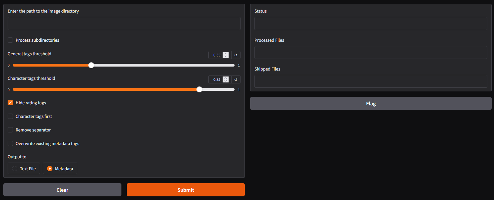

# AI Image Auto Tagger

The successor of WD14 tagger and alternative to DeepDanbooru - now with metadata saving feature for nsfw-oriented gallery tagging (optimized for digiKam). Currently using wd-vit-tagger-v3 model (dataset as of 2024-02-28) by SmilingWolf which is newer than WD14 and DeepDanbooru. Using CUDA and ONNX library over Gradio WEBUI. Tested on Windows.

## Features
- **Supported models**: Latest WaifuDiffusion v3 tagger architecture featuring SmilingWolf/wd-vit-tagger-v3 model
- **Supported files**: JPG/JPEG (recommended), PNG, WEBP, GIF, BMP(no metadata)
- **Easy user interface**: By utilizing gradio for GUI, the usage of this script should be smooth
- **Process subdirectories**: recursively goes through all directories within a given one. In case of writing tags to *.txt* it mirrors the folder structure 
- **User preferred threshold**: Using the gradio slider, the user can adjust the threshold of the tagger model
- **Hide rating tags**: You can optionally choose whether to output the rating tags (Like "General", "Explicit", "Questionable", etc) or not by checklist the "Hide Rating Tags" box
- **Character tags first**: This feature makes the character name tag appear in front before other tags like general, copyright or rating. This feature is useful when training the text encoder with "keep n tokens"
- **Remove separator**: This function will remove the standard separator "_" of the tags in the output caption
- **Overwrite existing metadata tags**: wipes clean any existing tags in metadata before writing new ones (XMP:Subject and IPTC:Keywords) 
- **Output**: There are 2 output modes: 1. embedding tags directly into image *metadata* 2 *.txt* files

## How to run  
Python >3.10 and CUDA GPU is required to run this script. Download from [https://www.python.org/downloads](https://www.python.org/downloads/windows/)  
ExifTool >12.15 is required. Download from [https://exiftool.org](https://exiftool.org)

Steps to run:
1. Clone this repository `git clone https://github.com/Deiwulf/AI-image-auto-tagger.git` OR download as a zip and extract
2. Navigate to directory `cd AI-image-auto-tagger`
3. Set up a virtual environment `python -m venv venv` *
4. Activate the new venv: *
    - Windows: `venv\scripts\activate` 
5. Install the requirements `pip install -r requirements.txt`  
    - Optionally visit https://pytorch.org/ and install one fitting your system for performance boost (~69% here)   
6. Run the script `python wdv3tagger.py` OR use `start.bat` on Windows (using venv)

\* Virtual environment is optional, but recommended to keep this isolated, you can skip to step 5 if you want to install and run on global environment

## Disclaimer
This has been thoroughly tested, but it's still under development so do be savvy and backup before running, and report issues if any.
